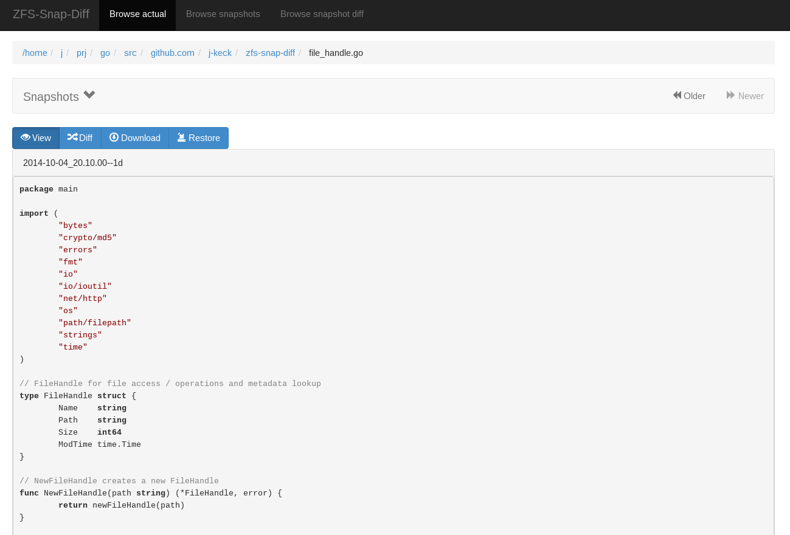
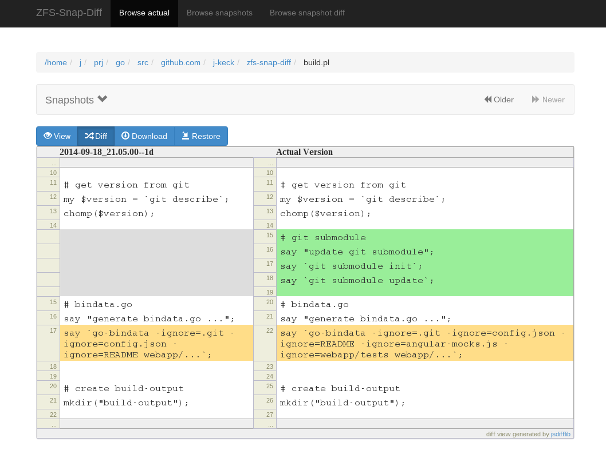
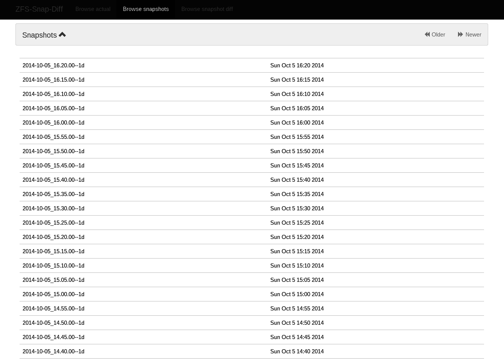
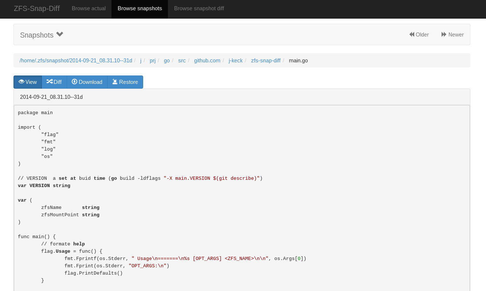

# Background
  
I make every 5 minutes a snapshot (keep it for 1 day) and once a day for long term (keep it for one month) from my home partition on a ZFS filesystem.
If i messed up a file, i need to search a clean state from the file in the snapshots - not always easy if i don't realize it directly.

`zfs-snap-diff` is a little tool to help me for such cases.

# Description

With `zfs-snap-diff` you can explore file differences from different zfs snapshots to the actual file version or browse in old snapshots.

  
`zfs-snap-diff` has a web frontend, so it can run on your local work machine or on your remote file / backup server (no Xserver necesarry).

To keep it protable and independent, it's made as a single executable with all html / js stuff included.
The backend is implemented in golang, the frontend with [angularjs](https://angularjs.org), [bootstrap](http://getbootstrap.com) ,[jsdifflib](https://github.com/cemerick/jsdifflib) 
and [highlight.js](https://github.com/isagalaev/highlight.js).

  
*!! it's in a very early dev state - only tested on FreeBSD !!*

#Usage

## Startup a server instance

      ./zfs-snap-diff [OPT_ARGS] <ZFS_NAME>
  
  * starts a web server on port http://127.0.0.1:12345
  * optional arguments:
    * -a: listen on all interfaces (default: listen only on localhost)
    * -p: web server port (default: 12345)
    * -default-file-action: file action when a file is selected (default: view):
      * off: no action
      * view: view the file from the given snapshot
      * diff: diff the file from the given snapshot with the actual version
      * download: download the file from the given snapshot
      * restore: restore the file from the given snapshot
    * -diff-context-size: context size in diff (default: 5)
    * -scan-snap-limit: limit how many snapshots are scan to search older file version (default: scan all)
      * negative limit: scan all snapshots
      * recommended if you have many snapshots
    * -compare-file-method: compare method when searching in snapshots for other file versions (default: size+modTime)
      * supported methods:
        * size+modTime: compares per size and modification time (very cheap)
        * size: compares per size (very cheap)
        * md5: compares per md5 (VERY EXPENSIVE! combine it with '-scan-snap-limit' and use it only for text files!)
      * use size or md5 when you work on files in a scm where you switch branches (this updates the file modTime).

  

## Connect with your web browser

      http://localhost:12345

  
## Browse actual filesystem state 

### Search a file
  
Search a file in the file browser.
    

  
### Select a file

When a file is selected, `zsd-snap-diff` search all snapshots where the selected file was modified (default: size+modTime, optional: size or md5).
    

  

### Select a snapshot

When you select a snapshot, you can view, diff, download or restore the selected file.

#### View

#### Diff
    

## Browse snapshot state

### Search a snaphot

Search a snapshot in the snapshot browser. All snapshots are displayed in this view.
  

### Select a snapshot

When a snapshot is selected, the file-browser shows the content from this snapshot.
From here you can easy restore / view a deleted file.
  

  
#Notes

  * if you download a file from a snapshot, the generated file name has the snapshot name included:

        <ORG_FILE_NAME>-<SNAPSHOT_NAME>.<FILE_SUFFIX>

  * if you restore a file, the orginal file will be renamed as:

        <ORG_FLILE_NAME>_<TIMESTAMP>
  
  * for snapshot differences (Browse snapshot diff), you need to set the diff permission:

        zfs allow -u <USER_NAME> diff <ZFS_NAME>

  

# Installation
  
## Prebuild

  Get a package for your platform from: https://github.com/j-keck/zfs-snap-diff/releases/latest

 *ping me if your platform is missing*
    
## Manual build

  * clone the repository

        git clone github.com/j-keck/zfs-snap-diff

  * change into the project directory

        cd zfs-snap-diff

  * init submodule

        git submodule init

  * update submodule

        git submodule update

  * generate golang src from static web content (this generates bindata.go)
  
        go-bindata webapp/...

  * build it
  
        go build -ldflags "-X main.VERSION $(git describe)"

  
# Changelog

###0.0.X###
  
0.0.5:
  * file compare method configurable: size+modTime (default) or md5
  * optional limit how many snapshots are scan to search older file version
  * autohide messages in frontend
  * show message if no snapshots found
  
0.0.4:
  * view, diff, download or restore file from a snapshot
  * view file with syntax highlight
  * browse old snapshot versions
  * easy switch "versions" per 'Older' / 'Newer' buttons
  * cleanup frontend
  * refactor backend
  
0.0.3:
  * show server errors on frontend
  * show waiting spinner when loading
  
0.0.2 :
  * partial frontend configuration from server
  * fix firefox ui

0.0.1:
  * prototype  
