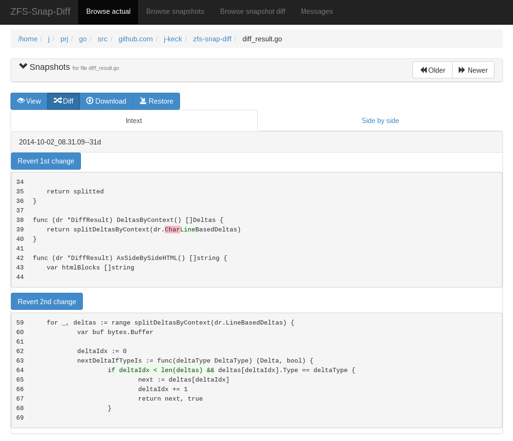
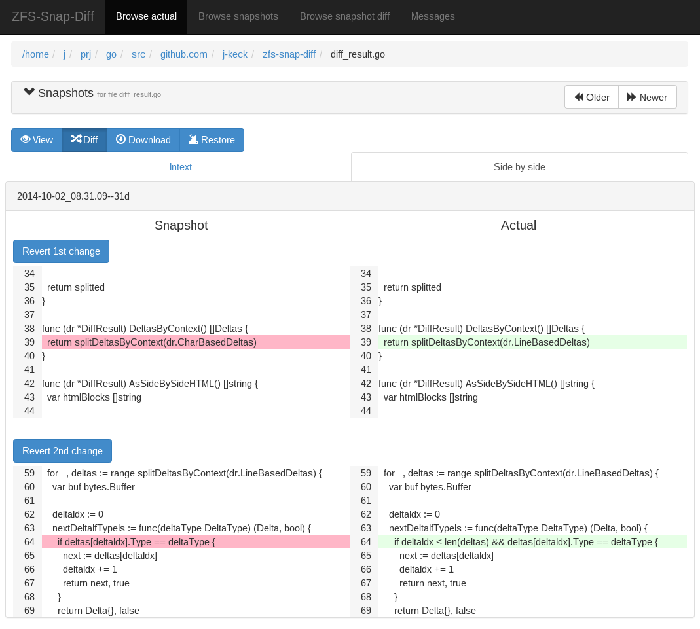
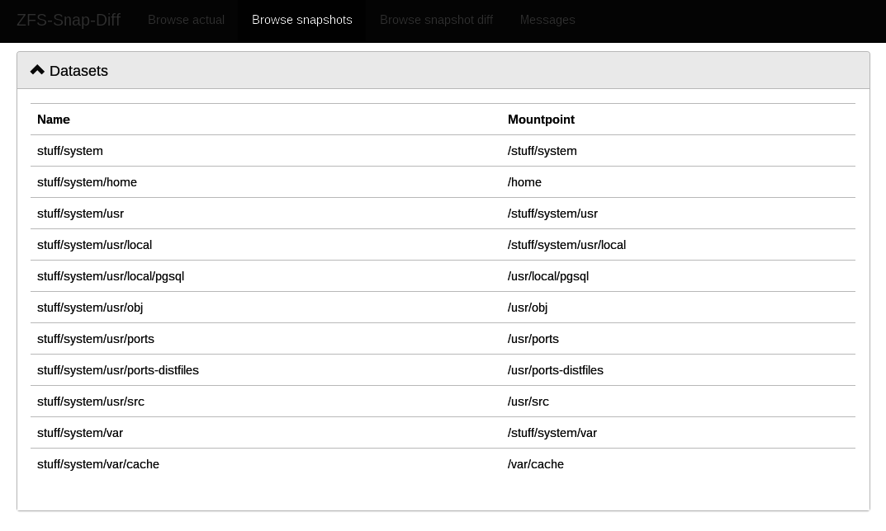

# Background
  
I make every 5 minutes a snapshot (keep it for 1 day) and once a day for long term (keep it for one month) from my home partition on a ZFS filesystem.
If i messed up a file, i need to search a clean state from the file in the snapshots - not always easy if i don't realize it directly.

`zfs-snap-diff` is a little tool to help me for such cases.

# Description

With `zfs-snap-diff` you can explore file differences and restore changes from older file versions in different zfs snapshots.
You can restore the whole file from a older version, or select single changes to revert in the 'Diff' view.

  
`zfs-snap-diff` has a web frontend, so it can run on your local work machine or on your remote file / backup server (no Xserver necesarry).

To keep it protable and independent, it's made as a single executable with all html / js stuff included.
The backend is implemented in golang, the frontend with [angularjs](https://angularjs.org), [bootstrap](http://getbootstrap.com) and [highlight.js](https://github.com/isagalaev/highlight.js).

  
#Usage

## Startup a server instance

      ./zfs-snap-diff [OPT_ARGS] <ZFS_NAME>
  
  * starts a web server on port http://127.0.0.1:12345
  * optional arguments:
    * -a: listen on all interfaces (default: listen only on localhost)
    * -p: web server port (default: 12345)
    * -default-file-action: file action when a file is selected (default: view):
      * off: no action
      * view: view the file from the given snapshot
      * diff: diff the file from the given snapshot with the actual version
      * download: download the file from the given snapshot
      * restore: restore the file from the given snapshot
    * -diff-context-size: context size in diff (default: 5)
    * -scan-snap-limit: limit how many snapshots are scan to search older file version (default: scan all)
      * negative limit: scan all snapshots
      * recommended if you have many snapshots
    * -compare-file-method: compare method when searching in snapshots for other file versions (default: auto)
      * supported methods:
        * auto: compares text files per md5, others by size+modTime
        * size+modTime: compares per size and modification time (very cheap)
        * size: compares per size (very cheap)
        * md5: compares per md5 (VERY EXPENSIVE! combine it with '-scan-snap-limit' and use it only for text files!)
    * -use-sudo: use sudo when executing os commands
      * necessary under linux when running as non root
      * adjust sudo rules (see [doc/etc/sudoers.d/zfs-snap-diff](https://github.com/j-keck/zfs-snap-diff/blob/master/doc/etc/sudoers.d/zfs-snap-diff))

  

## Connect with your web browser

      http://localhost:12345

  
## Browse actual filesystem state 

### Search a file
  
Search a file in the file browser.
    

  
### Select a file

When a file is selected, `zsd-snap-diff` search all snapshots where the selected file was modified (text files per md5, others per size+modTime).
    

  

### Select a snapshot

When you select a snapshot, you can view, diff, download or restore the file from the selected snapshot.

#### View
View the file content from an older file version.

#### Diff
Explore file differences and pick single changes to revert.
  

  

## Browse snapshot state

### Select a dataset

Select a dataset (sub zfs filesystem).
  

  
### Search a snaphot

Search a snapshot in the snapshot browser. All snapshots from the selected dataset are displayed in this view.
  

### Select a snapshot

When a snapshot is selected, the file-browser shows the content from this snapshot.
From here you can easy restore / view a deleted file.
  

 

# Installation
  
## Prebuild

  Get a package for your platform from: https://github.com/j-keck/zfs-snap-diff/releases/latest

 *ping me if your platform is missing*
    
## Manual build

  * clone the repository

        git clone github.com/j-keck/zfs-snap-diff

  * change into the project directory

        cd zfs-snap-diff

  * fetch dependencies ([go-diff](https://github.com/sergi/go-diff))

          go get -u  

  * build it

          go build -ldflags "-X main.VERSION $(git describe)"

  
#Notes

  * if you download a file from a snapshot, the generated file name has the snapshot name included:

        <ORG_FILE_NAME>-<SNAPSHOT_NAME>.<FILE_SUFFIX>

  * if you restore / patch a file, the orginal file will be saved under:

        ./zsd/<ORG_FLILE_NAME>_<TIMESTAMP>

  * for snapshot differences (Browse snapshot diff), you need to set the diff permission:

        zfs allow -u <USER_NAME> diff <ZFS_NAME>

   

# Coding Notes

  * if you change something under 'webapp/' 

    * start `zfs-snap-diff` per `ZSD_SERVE_FROM_WEBAPP=YES ./zfs-snap-diff <ZFS_NAME>`
      to serve the static content from the `webapp` folder

    * re-generate bindata.go and recompile `zfs-snap-diff`
      * sh ./gen-bindata.sh
      * go build -ldflags "-X main.VERSION $(git describe)"

# Changelog

###0.0.X###

0.0.7:
  * support sub zfs filesystems (datasets)
  * optional use sudo when execute zfs commands
    * necessary under linux when running as non root
    * needs sudo rules (see [doc/etc/sudoers.d/zfs-snap-diff](https://github.com/j-keck/zfs-snap-diff/blob/master/doc/etc/sudoers.d/zfs-snap-diff))
    * start `zfs-snap-diff` with '-use-sudo'
  * new view for server messages
  
[all commits from 0.0.6...0.0.7](https://github.com/j-keck/zfs-snap-diff/compare/0.0.6...0.0.7)
  
0.0.6:
  * check if file in snapshot has changed filetype depend:
    * text files: md5
    * others: size+modTime
  * diffs created in the backend (per [go-diff](https://github.com/sergi/go-diff))
    * different presentation: intext / side by side
    * possibility to revert single changes
  
[all commits from 0.0.5...0.0.6](https://github.com/j-keck/zfs-snap-diff/compare/0.0.5...0.0.6)  
   
  
0.0.5:
  * file compare method configurable: size+modTime (default) or md5
  * optional limit how many snapshots are scan to search older file version
  * autohide notifications in frontend
  * show message if no snapshots found
  
[all commits from 0.0.4...0.0.5](https://github.com/j-keck/zfs-snap-diff/compare/0.0.4...0.0.5)  
  
0.0.4:
  * view, diff, download or restore file from a snapshot
  * view file with syntax highlight
  * browse old snapshot versions
  * easy switch "versions" per 'Older' / 'Newer' buttons
  * cleanup frontend
  * refactor backend
  
[all commits 0.0.3...0.0.4](https://github.com/j-keck/zfs-snap-diff/compare/0.0.3...0.0.4)    
  
0.0.3:
  * show server errors on frontend
  * show waiting spinner when loading

[all commits 0.0.2...0.0.3](https://github.com/j-keck/zfs-snap-diff/compare/0.0.2...0.0.3)        
  
0.0.2 :
  * partial frontend configuration from server
  * fix firefox ui

[all commits 0.0.1...0.0.2](https://github.com/j-keck/zfs-snap-diff/compare/0.0.1...0.0.2)      

0.0.1:
  * prototype  
