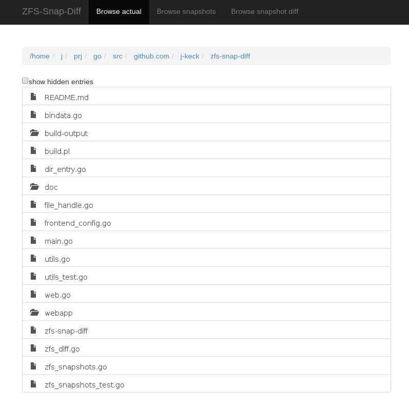
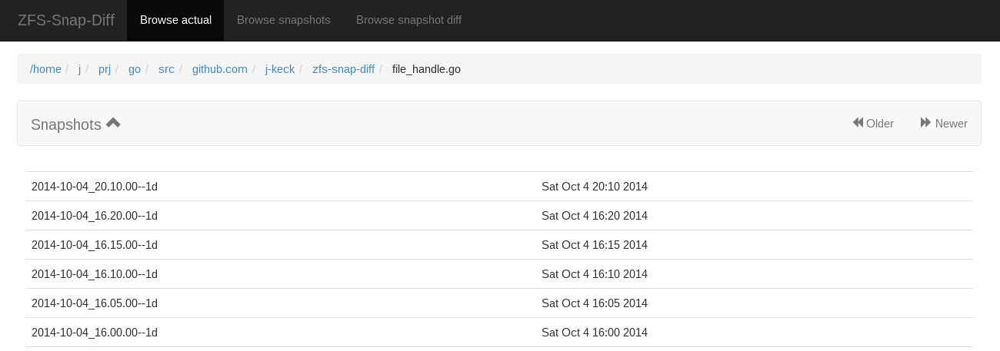
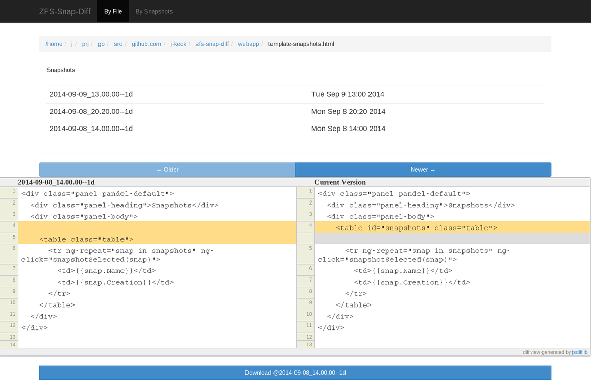

I make every 5 minutes a snapshot from my ZFS filesystem (keep it for 1 day).
If i messed up a file, i need to search a clean state from the file in the snapshots - not always easy if don't realize it directly.

`zfs-snap-diff` is a little standalone tool (one executable with all inside) to help me for such cases.

!! it's in a very early dev state - only tested on FreeBSD !!

#Usage

### Search a file
  
Search a file in the file browser.
    

### Select a file

When a file is selected, `zsd-snap-diff` search all snapshots where the selected file was modified (currently it compares only mod-time and file-size).
    

  

### Select a snapshot

When you select a snapshot, and

  * the file size is > 100MB: it downloads the selected file
  * the file is a text file: it shows a diff from the selected snapshot to the current state
  * the file is a binary file: it embed the file (per embed tag)

  

----

If you download a file from a snapshot, the generated name are: `<ORG_FILE_NAME>-<SNAPSHOT_NAME>.<FILE_SUFFIX>`.

  

  
# Build:

  * generate golang src from static web content (this generates bindata.go)
  
      go-bindata webapp/...

  * build it
  
      go build -ldflags "-X main.VERSION $(git describe)"

# Run:

  
`./zfs-snap-diff <ZFS_NAME>` 

  * starts a web server on port 127.0.0.1:12345 
  * all html / javascript files included (including bootstrap, jquery, angularjs, jsdifflib)

### for dev:
  
`ZSD_SERVE_FROM_WEBAPPS=YES ./zfs-snap-diff <ZFS_NAME>` 

  * serve static content from webapps dir (for dev)

# Changelog

###0.0.X###
  * 0.0.1 prototype  
