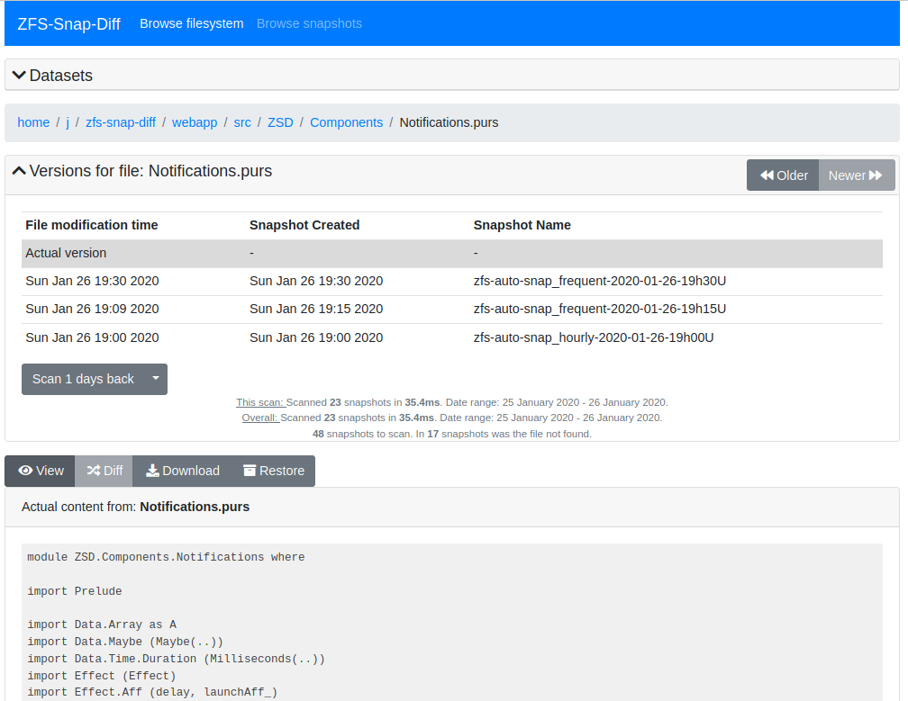

# `zfs-snap-diff`

in this branch i rewrite the whole codebase.

  - backend is implemented in [Go](https://golang.org) (as before)
  - frontend in [PureScript](http://purescript.org) (with [react-basic](https://pursuit.purescript.org/packages/purescript-react-basic))

You need only `go` to build this project.
I compile the frontend code to javascript and decode it in `pkg/webapp/bindata.go`.

## Build from source

### Build with `go`

  - clone this repo: `git clone -b dev https://github.com/j-keck/zfs-snap-diff`
  - change to the checkout directory: `cd zfs-snap-diff`
  - build it: `go build -ldflags="-X main.version=$(git describe)" github.com/j-keck/zfs-snap-diff/cmd/zfs-snap-diff`

The optional `-ldflags="-X main.version=$(git describe)"` flag updates the `version` string in the binary.

### Build with `nix`

The `nix` build also compiles the frontend to javascript and decode it in `pkg/webapp/bindata.go`.

  - clone this repo: `git clone -b dev https://github.com/j-keck/zfs-snap-diff`
  - change to the checkout directory: `cd zfs-snap-diff`
  - build it: `nix-build -A zfs-snap-diff`

To crosscompile the binary for

  - FreeBSD: `nix-build -A zfs-snap-diff --argstr goos freebsd`
  - MacOS: `nix-build -A zfs-snap-diff --argstr goos darwin`
  - Solaris: `nix-build -A zfs-snap-diff --argstr goos solaris`

## Run it

  `./zfs-snap-diff <POOL>`

after the rewrite is done, i can add new features.

implemented new features:

  - works now also with 'legacy' mountpoints
